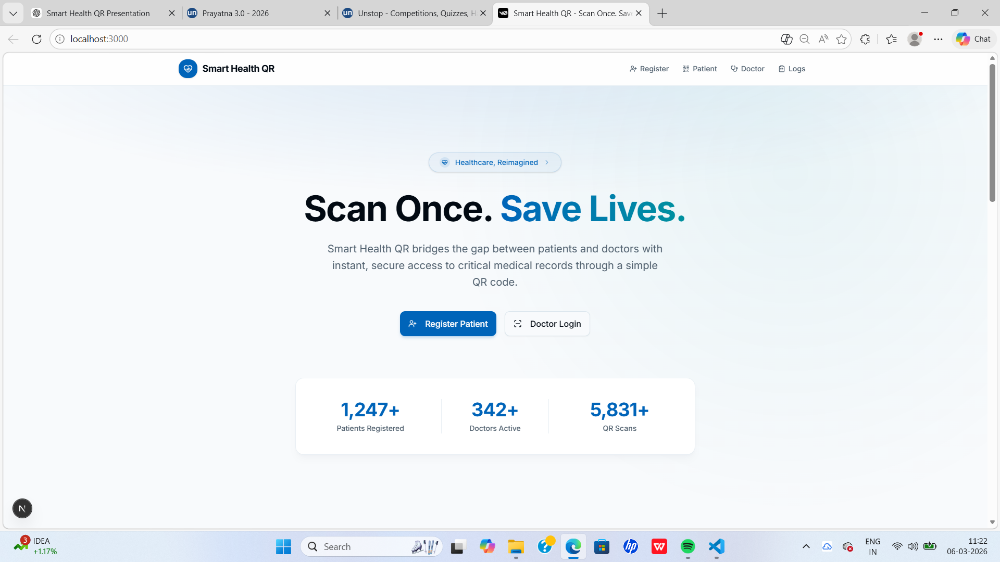
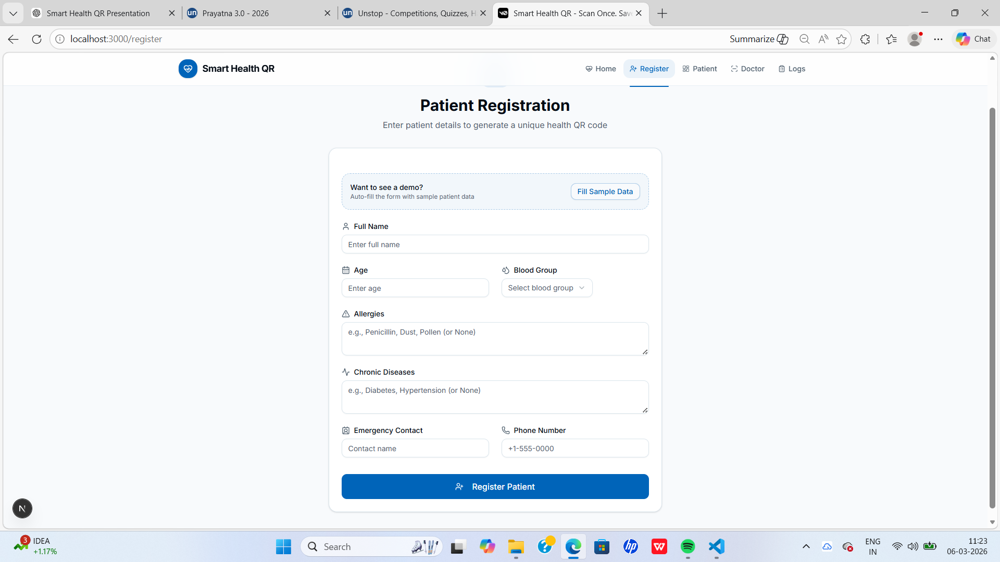
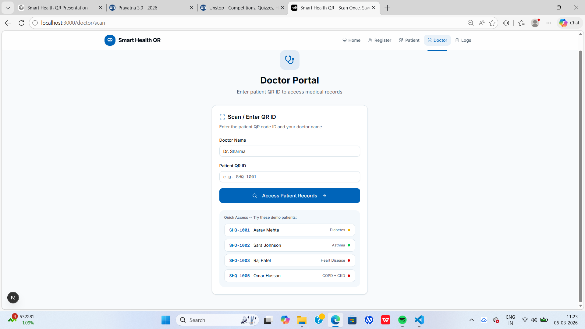
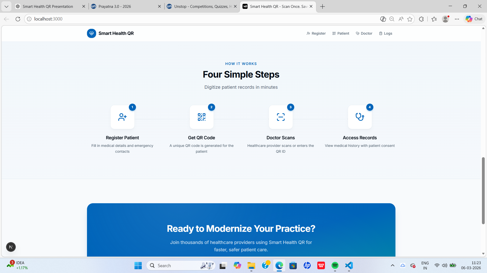

# 🏥 Smart Health QR

A secure QR-based healthcare record access system that allows doctors to quickly access patient medical information during emergencies.

This project was developed as a **hackathon prototype** to demonstrate how QR technology can simplify emergency medical data access while maintaining patient privacy.

---

## 🚀 Project Overview

Smart Health QR bridges the gap between patients and healthcare providers by enabling **instant access to essential medical records through a QR code**.

Patients register their medical details and receive a unique QR code. Healthcare professionals can scan or enter the QR ID to view important medical information in emergencies.

This helps doctors make **faster and safer decisions during critical situations**.

---

## ✨ Features

- 🔐 Secure patient record management
- 📱 Unique QR ID generation for every patient
- 👨‍⚕️ Doctor portal to access patient records
- 🧾 Patient registration with medical details
- ⚡ Emergency access to critical information
- 📊 Access logs for tracking record usage
- ⏱ Time-bound session control
- 🛡 Privacy-first design

---

## 🛠 Tech Stack

**Frontend**
- React.js
- Next.js
- TypeScript
- Tailwind CSS

**Backend**
- Node.js

**UI Components**
- Shadcn UI
- Radix UI

**Other Tools**
- Git & GitHub
- VS Code

---

## 🧩 System Workflow

1️⃣ Patient registers and enters medical details  
2️⃣ System generates a unique **QR ID** for the patient  
3️⃣ Doctor scans or enters the QR ID  
4️⃣ System displays medical records with patient consent  

---

## 📷 Screenshots


### Landing Page


### Features


### Patient Registration


### Doctor Portal


### System Workflow


## 💻 Installation & Setup

Clone the repository:

```bash
git clone https://github.com/KUMARI-SONALIUPADHYAY/smart-health-qr.git

## 🌐 Live Demo

https://smart-health-qr-demo.vercel.app